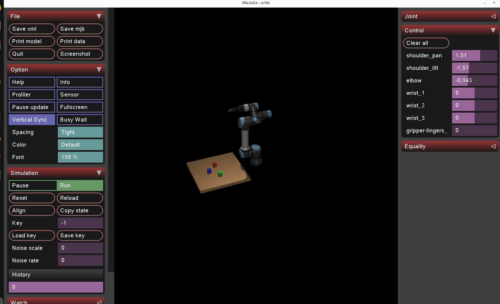
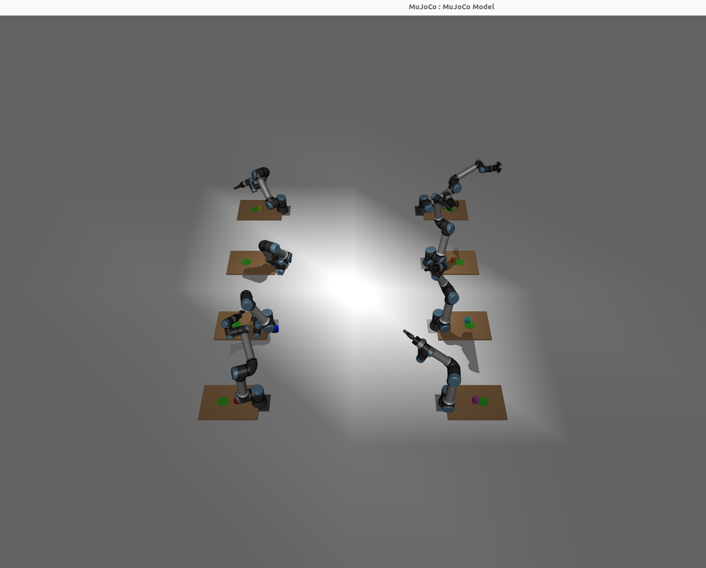

# mujoco-ur-arm-rl

Reinforcement learning training environment for the Universal Robots UR5e arm using MuJoCo, with a Robotiq 2F-85 gripper and graspable objects.



## Overview

- **Robot**: UR5e + Robotiq 2F-85 gripper
- **Task**: Reach / pick-and-place / cooperative handover
- **Algorithm**: SAC (Stable-Baselines3)
- **Simulator**: MuJoCo 3.x

## Environments

| Env | Task | Arms |
|-----|------|------|
| `URReachEnv` | Move end-effector to target | 1 |
| `URPickPlaceEnv` | Pick box and place at target | 1 |
| `URDualArmEnv` | Symmetric multi-arm pick / lift / place | 4+ even |
| `SharedArmPickPlaceEnv` | Reusable local policy extracted from symmetric arms | 1 (local view) |

## Multi-Arm Training



Four or more UR5e arms with Robotiq 2F-85 grippers arranged symmetrically. Each arm gets its own table, object, and drop zone, and the layout can scale to 8 arms in the same pattern.

The current multi-arm reward is contact-gated: the policy is rewarded for approaching the object, but grasp/lift progress only counts once the object actually contacts both gripper sides and starts moving upward.

```bash
python3 scripts/train/train_dual_arm_live.py --arms 4 --n-envs 4

python3 scripts/train/train_dual_arm_live.py --arms 8 --n-envs 2
```

## Setup

```bash
pip install mujoco gymnasium stable-baselines3
```

Clone [MuJoCo Menagerie](https://github.com/google-deepmind/mujoco_menagerie) to `/home/asimov/mujoco_menagerie`.

## Project Layout

- `envs/`: MuJoCo Gymnasium environments
- `scripts/train/`: training entrypoints
- `mujoco_ur_rl_ros2/`: ROS2 policy node package
- `launch/`: ROS2 launch files
- `assets/`: README images and visual references

## Train

```bash
# Single arm reach
python3 scripts/train/train.py

# Single arm pick-and-place
python3 scripts/train/train_pick_place.py

# Multi-arm training, headless by default
python3 scripts/train/train_dual_arm_live.py --arms 4 --n-envs 4

# Larger symmetric layout
python3 scripts/train/train_dual_arm_live.py --arms 8 --n-envs 2

# Same trainer, but with the MuJoCo viewer
python3 scripts/train/train_dual_arm_live.py --arms 4 --n-envs 2 --viewer

# Use GPU when PyTorch CUDA is available
python3 scripts/train/train_dual_arm_live.py --arms 4 --n-envs 4 --device cuda

# Train one reusable 7-action arm policy in an 8-arm scene
python3 scripts/train/train_shared_arm.py --arms 8 --n-envs 4 --device cuda

# Faster shared-policy mode: every arm in each scene contributes a sample each step
python3 scripts/train/train_shared_arm.py --arms 8 --n-envs 2 --all-arms-samples --device cuda

# Apply that one shared arm policy to every arm in a 4-arm or 8-arm scene
python3 scripts/train/play_shared_arm.py --model models/shared_arm/<run_name>/best_model.zip --arms 8 --viewer --deterministic
```

Best multi-arm models and checkpoints are saved under `models/multi_arm/`, run logs under `logs/multi_arm/`.
Shared one-arm policy runs use `models/shared_arm/` and `logs/shared_arm/`.

## Monitor Progress

```bash
# Find the newest run directory
cat logs/multi_arm/latest_run.txt

# Watch the live console log
tail -f logs/multi_arm/<run_name>.out

# Check the latest heartbeat
cat logs/multi_arm/<run_name>/latest_status.json
```

Useful signals:
- `timesteps`: training is advancing
- `ep_rew_mean`: average training reward per finished episode
- `eval_mean_reward`: evaluation reward from the latest eval pass
- `fps`: simulation throughput

## ROS2 Package

This repo can also act as a ROS2 Python package named `mujoco_ur_rl_ros2`. The packaged node loads a trained SAC policy and publishes UR5e joint trajectories.

Build it from a ROS2 workspace:

```bash
mkdir -p ~/ros2_ws/src
cd ~/ros2_ws/src
git clone https://github.com/darshmenon/mujoco-ur-arm-rl.git
cd ~/ros2_ws
colcon build --packages-select mujoco_ur_rl_ros2
source install/setup.bash
```

The ROS2 node still expects the Python environment to have `numpy` and `stable-baselines3` available.

Run the node directly:

```bash
ros2 run mujoco_ur_rl_ros2 ur_policy_node --ros-args \
  -p model_path:=/home/asimov/mujoco-ur-arm-rl/models/best_model.zip \
  -p target_x:=0.4 -p target_y:=0.0 -p target_z:=0.4
```

Or launch it:

```bash
ros2 launch mujoco_ur_rl_ros2 ur_policy.launch.py \
  model_path:=/home/asimov/mujoco-ur-arm-rl/models/best_model.zip
```

ROS2 files added in this repo:
- `package.xml`, `setup.py`, `setup.cfg`
- `mujoco_ur_rl_ros2/ur_policy_node.py`
- `launch/ur_policy.launch.py`
- `ros2/ur_policy_node.py` remains as a compatibility wrapper

## Visualize

```bash
python3 scripts/train/train_dual_arm_live.py --arms 4 --n-envs 1 --viewer
```
